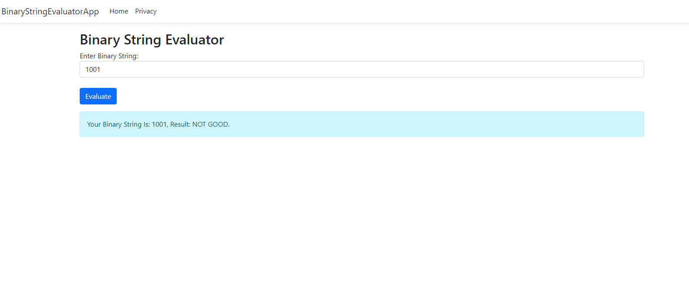

# Binary String Evaluator (ASP.NET Core)

This is a simple ASP.NET Core MVC project that evaluates binary strings based on two criteria:

The binary string contains an equal number of 0's and 1's.
For every prefix of the binary string, the number of 1's must be greater than or equal to the number of 0's.

# Get started

## Clone the repo

git clone https://github.com/dharmin-wa/Task2.git

cd Task2

# Usage
Enter a binary string in the input field on the home page.
Click on the Evaluate button.
The application will evaluate the string and display whether the binary string is GOOD or NOT GOOD based on the following criteria:
The binary string has an equal number of 1's and 0's.
For every prefix, the number of 1's is not less than the number of 0's.

# Example
Input: 1100

Output: Test Binary String: 1100, Expected: GOOD, Got: GOOD

Input: 1001

Output: Test Binary String: 1001, Expected: GOOD, Got: NOT GOOD

# Project Structure
Controllers: Contains the BinaryStringController that handles user input and result display.
Models: Contains the BinaryStringEvaluator class that evaluates binary strings based on the criteria.
Views: Contains the Index.cshtml view, which is the main UI for user interaction.

# License
This project is licensed under the MIT License. See the LICENSE file for details.